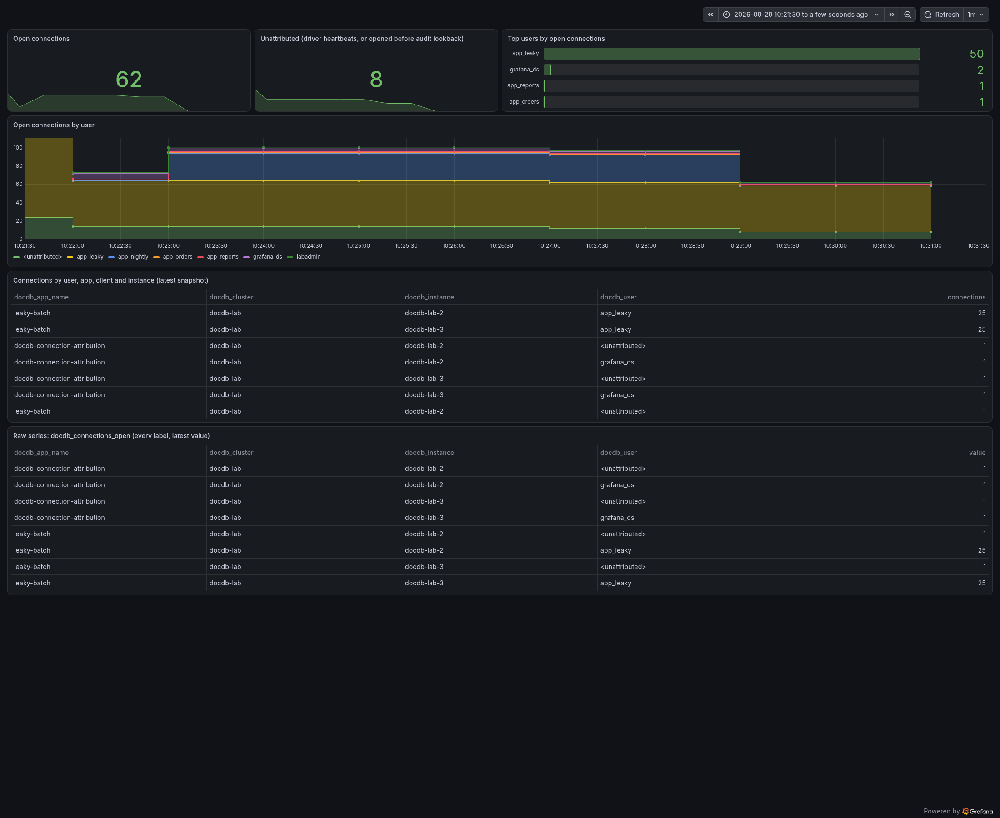
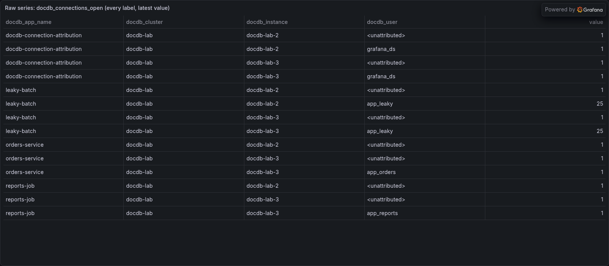
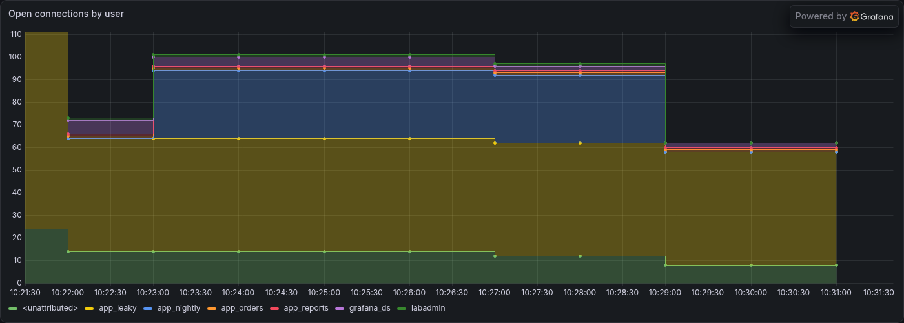
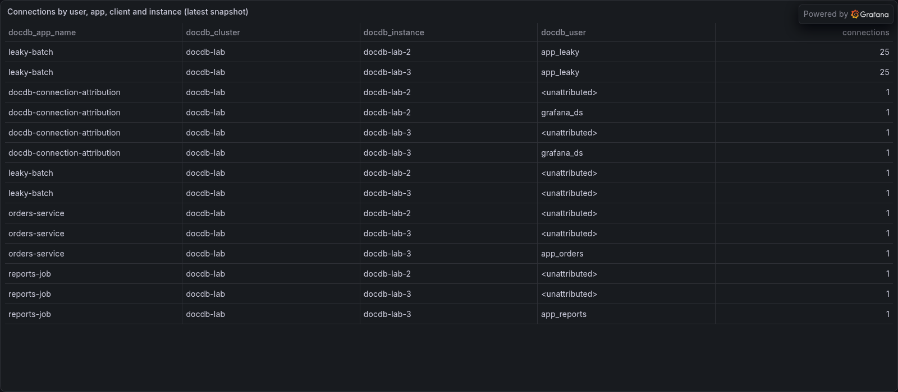

# docdb-connection-attribution: which database user is holding DocumentDB connections open

**Status: alpha. This is a reference implementation, not a supported product.**

CloudWatch's `DatabaseConnections` metric tells you how many connections an Amazon DocumentDB
instance has open, and nothing about who opened them. DocumentDB's own `$currentOp` lists every
open connection, but an **idle** connection carries no user: only its client `ip:port` and the
driver's app name. That is exactly the connection you care about when something leaks.

This example closes the gap. The DocumentDB audit log records an `authenticate` event with the
client `ip:port` and the user for every new connection. A scheduled Lambda joins the two and
exports a gauge per database user and app to Grafana Cloud over OTLP, with a dashboard.



## What is in the release download

```
README.md                          this file
lambda.zip                         the function code, ready to deploy
terraform/                         Terraform root module, with lambda.zip beside it
cloudformation/template.yaml       a single standalone template
cloudformation/parameters.example.json
dashboards/connections-by-user.json   Grafana dashboard for the exported metric
```

The repository also carries a traffic generator that creates lab users and a deliberate connection
leak, used to produce the screenshots on this page:
[`dev/loadgen.py`](https://github.com/rknightion/grafana-cloud-reference-examples/blob/main/examples/docdb-connection-attribution/dev/loadgen.py).

## What you need before you start

1. **Auditing on the cluster, exported to CloudWatch Logs.** Both are required:
   - A custom cluster parameter group with `audit_logs` set to `ddl`. `ddl` is enough, because
     authentication events are logged at that level; you do not need the more expensive DML
     auditing. **Attaching a custom parameter group to a cluster only takes effect after each
     instance reboots**; until then the parameter status reads `pending-reboot`.
   - The cluster's `audit` log export enabled, which writes to `/aws/docdb/<cluster>/audit` with
     one log stream per instance.

   ```bash
   aws docdb create-db-cluster-parameter-group --db-cluster-parameter-group-name acme-audit \
     --db-parameter-group-family docdb5.0 --description "audit_logs=ddl"
   aws docdb modify-db-cluster-parameter-group --db-cluster-parameter-group-name acme-audit \
     --parameters "ParameterName=audit_logs,ParameterValue=ddl,ApplyMethod=immediate"
   aws docdb modify-db-cluster --db-cluster-identifier acme-docdb-cluster \
     --db-cluster-parameter-group-name acme-audit \
     --cloudwatch-logs-export-configuration '{"EnableLogTypes":["audit"]}' --apply-immediately
   aws docdb reboot-db-instance --db-instance-identifier acme-docdb-1   # once per instance
   ```

2. **A least-privilege DocumentDB user for the function**: built-in roles `clusterMonitor` on
   `admin` **and** `read` on `admin`. `clusterMonitor` alone is refused (code 13,
   `Authorization failure`) by the `$currentOp` aggregation stage the function uses.

3. **A Secrets Manager secret holding that user**, as JSON in the same shape DocumentDB's own
   managed secrets use: `{"username": "...", "password": "..."}`. Pass it as a file so the
   password stays out of your shell history.

4. **A Grafana Cloud OTLP endpoint, stack id and token.** On your stack's details page, open the
   **OpenTelemetry** tile: it shows the OTLP endpoint
   (`https://otlp-gateway-<region>.grafana.net/otlp`) and the numeric instance id. Create a Cloud
   Access Policy with the `metrics:write` scope, then a token on it. The OTLP instance id is the
   **stack** id: a Mimir or Loki tenant id from the same stack will not authenticate here.

5. **Private subnets that can reach DocumentDB and the internet.** The function runs in your VPC.
   It needs to reach DocumentDB on 27017, and HTTPS egress to Grafana Cloud, the RDS CA truststore,
   and the Secrets Manager, CloudWatch Logs, RDS and DynamoDB APIs. A NAT gateway covers all of it.

6. Terraform 1.9+ with the AWS provider 5.80+, or the AWS CLI for CloudFormation.

See [Grafana Cloud credentials](../grafana-cloud-credentials.md) for how to create and store the
Grafana Cloud token.

## What this creates in your AWS account

- The Lambda function, its execution role, an explicit log group with retention, and error and
  throttle alarms. Reserved concurrency is 1, because the audit checkpoint has a single writer.
- A security group for the function: no ingress; egress 443 anywhere and 27017 to the VPC.
- **Optionally** one ingress rule on your DocumentDB security group allowing 27017 from the
  function's security group, if you pass that group's id. Nothing else about the cluster is
  touched.
- A DynamoDB table (on-demand, TTL on `expires_at`) holding which user authenticated on each
  client socket, plus the audit read checkpoint.
- An EventBridge rule that runs the function every minute.
- Read access to the two secrets you created. It does not create or modify them.

It never writes to DocumentDB. It reads `$currentOp` and nothing else, and it does not change the
cluster's parameter group, log exports or users.

## Deploy it

### Terraform

```bash
cd terraform
cp terraform.tfvars.example terraform.tfvars
$EDITOR terraform.tfvars          # cluster, subnets, both secrets, OTLP endpoint
terraform init
terraform apply
```

There is no backend block, on purpose. Creating a VPC-attached function takes two to three minutes
while Lambda provisions its network interfaces.

### CloudFormation

CloudFormation cannot upload function code from your machine, so put `lambda.zip` in an S3 bucket
first. The template takes the subnets as a list and needs the VPC CIDR for the 27017 egress rule.

```bash
aws s3 cp lambda.zip s3://my-artifacts/docdb-connection-attribution/lambda.zip

aws cloudformation deploy \
  --template-file cloudformation/template.yaml \
  --stack-name grafana-cloud-docdb-connection-attribution \
  --capabilities CAPABILITY_IAM \
  --parameter-overrides \
      DocDbClusterId=acme-docdb-cluster \
      DocDbCredentialsSecretId=docdb/connection-attribution \
      DocDbSecurityGroupId=sg-0123456789abcdef0 \
      GrafanaCloudOtlpEndpoint=https://otlp-gateway-prod-eu-west-2.grafana.net/otlp \
      CredentialsSecretId=grafana-cloud/otlp \
      VpcId=vpc-0123456789abcdef0 \
      SubnetIds=subnet-0123456789abcdef0,subnet-0fedcba9876543210 \
      VpcCidr=192.0.2.0/24 \
      LambdaCodeS3Bucket=my-artifacts \
      LambdaCodeS3Key=docdb-connection-attribution/lambda.zip
```

## Check it worked

1. **Run it once by hand** rather than waiting for the schedule:

   ```bash
   aws lambda invoke --function-name "$(terraform output -raw function_name)" /tmp/out.json
   cat /tmp/out.json
   ```

   A healthy run returns a summary such as
   `{"connections": 62, "unattributed": 8, "series": 14, "audit_events": 221, "audit_complete": true, "failed_instances": []}`.
   The first run reads up to a week of audit history, so `audit_events` is large once and small
   after that.

2. **Read the function's own log line**, which carries the same summary.

3. **Find the data in Grafana Cloud.** In Explore, on your stack's Prometheus data source:

   ```promql
   sum by (docdb_instance, docdb_user) (last_over_time(docdb_connections_open[2m]))
   ```

   Expect one series per instance and user. The function's own user appears with one connection per
   instance.

   

4. **Import the dashboard.** In Grafana, **Dashboards -> New -> Import**, upload
   [`dashboards/connections-by-user.json`](https://github.com/rknightion/grafana-cloud-reference-examples/blob/main/examples/docdb-connection-attribution/dashboards/connections-by-user.json),
   and choose your Prometheus data source.

   

5. **Confirm nothing is stuck.** `audit_complete` should be `true` on every run after the first
   few. `false` means the audit read is still working through a backlog; it resumes where it
   stopped on the next run.

## Configuration

| Environment variable | Default | Meaning |
| --- | --- | --- |
| `DOCDB_CLUSTER_ID` | required | Cluster identifier. Every available instance in it is queried. |
| `DOCDB_CREDENTIALS_SECRET_ID` | required | Secret with `{"username", "password"}` for the least-privilege user. |
| `AUDIT_LOG_GROUP` | `/aws/docdb/<cluster>/audit` | Where the cluster exports its audit log. |
| `AUDIT_BACKFILL_MINUTES` | `10080` (7 days) | How far back the first run reads. |
| `MAPPING_TTL_DAYS` | `14` | How long a socket-to-user mapping lives without being seen. |
| `GRAFANA_CLOUD_OTLP_ENDPOINT` | required | OTLP gateway base URL, ending `/otlp`. |
| `GRAFANA_CLOUD_CREDENTIALS_SECRET_ID` | required | Secret with `{"tenant_id", "token"}`, or a bare token. |
| `INCLUDE_CLIENT_ADDRESS` | `false` | Add the client host (no port) as the `client_address` label. |
| `LOG_LEVEL` | `INFO` | The function's own log level. |

The schedule is `rate(1 minute)` by default.

### Metrics, and what deliberately is not a label

| Metric (in Mimir) | Labels |
| --- | --- |
| `docdb_connections_open` | `docdb_cluster`, `docdb_instance`, `docdb_user`, `docdb_app_name`, optionally `client_address` |
| `docdb_attributor_audit_events` | `docdb_cluster` |

`docdb_user` is `<unattributed>` when no user could be found; see Limitations. The client **port**
is never a label: it is different for every connection, so it would create a series per
connection. See [OTLP vs Loki Push](../otlp-vs-loki-push.md) for why this example exports over OTLP
rather than pushing logs, and [Loki Ingestion](../loki-ingestion.md) for the general label
discipline every example in this repository follows.

Each run pushes one snapshot, and nothing marks a series stale when its last connection closes.
**Query with `last_over_time(...[2m])`, a window of at least two schedule intervals**, or a closed
connection keeps showing for the 5-minute Prometheus lookback. The shipped dashboard does this.



## What it costs

- **Lambda:** 1,440 runs a day at 256 MB and typically 1 to 8 seconds each. A few cents a day.
- **DocumentDB audit log ingest into CloudWatch Logs** is usually the largest line, and it is
  driven by how often your applications open connections, not by this example. The lever is
  connection pooling in your applications, which is also the fix for most leaks.
- **CloudWatch Logs `FilterLogEvents`:** one short read of new events per run.
- **DynamoDB on demand:** one write per new client socket, one batch read per run, and one
  TTL-refresh write per long-lived connection.
- **Grafana Cloud:** one active series per (instance, user, app), plus the client host when
  enabled. Tens of series for a typical cluster.
- **NAT gateway** data processing, if the function's egress goes through one.

## Troubleshooting

**The run fails with `Authorization failure` (code 13).** The DocumentDB user has
`clusterMonitor` but not `read` on `admin`. Grant both.

**Every connection is `<unattributed>`.** No authenticate events are reaching the function. Check
that the log group exists and has recent events. If it is empty, `audit_logs` is not applied (the
instance still needs its reboot) or the `audit` log export is not enabled.

**A few connections per instance are always `<unattributed>`.** Expected. Every driver keeps one or
two monitoring (heartbeat) connections per server that never authenticate.

**The function times out with no log line.** It cannot reach something: DocumentDB on 27017, or
HTTPS egress. Check the subnets' route to a NAT gateway, and that the DocumentDB security group
allows 27017 from the function's security group.

**`OTLP metrics export to Grafana Cloud failed` with a 401 above it.** The tenant id is not the
stack id, or the token lacks `metrics:write`. The OTLP gateway takes the stack's numeric instance
id, not a Mimir or Loki tenant id.

**`certificate signed by unknown authority` or `x509` errors.** The function could not fetch the
RDS CA bundle, or you pointed `DOCDB_CA_BUNDLE_URL` at the wrong file.

**`audit_complete` stays `false`.** The audit backlog is larger than one run can read. Each run
continues from its saved page, so this clears on its own; a very busy cluster can take several runs
after the first deploy.

**The dashboard still shows a connection that has closed.** The query is not bounded by
`last_over_time`; see the note under Configuration.

## Limitations

- **Connections opened before the audit history reaches cannot be attributed.** The first run reads
  back `AUDIT_BACKFILL_MINUTES` (7 days by default). Raise the backfill if your log group retains
  more.
- **A reused client port can briefly be attributed to its previous user.** The join matches on
  `ip:port`. An active connection's own user always wins over the audit match; only idle
  connections on a reused port in the gap before the new event arrives can be wrong.
- **Attribution lags new connections by the audit delivery delay**, usually under a minute.
- **The dashboard can only show what `$currentOp` reports.** It does not show connections held open
  by a proxy on your side.
- **Grafana's MongoDB Enterprise data source cannot replace this function.** `$currentOp` must run
  as a database-level aggregate, so every form of the query is rejected by that data source.
- Tested on DocumentDB 5.0 instance-based clusters. Elastic clusters are not covered.

## How it works

Each run does three things.

1. **Reads new audit events.** `FilterLogEvents` on the audit log group, filtered to
   `authenticate`, from a checkpoint stored in DynamoDB. Each event gives `remote_ip` (which
   includes the port) and `param.user`. The function keeps the newest event per socket and writes
   it with a condition that stops an older event from overwriting a newer one. Windows overlap by
   five minutes so late-delivered events are not missed.
2. **Lists open connections on every instance.** `$currentOp` with
   `{allUsers: true, idleConnections: true}` only reports the instance it runs on, so the function
   connects to each instance endpoint directly, reusing its client across runs so that it does not
   add an authenticate event of its own every minute.
3. **Joins and exports.** Each connection's `client` is looked up in the table. An active
   connection's own `effectiveUsers` wins, because it is current; an idle one takes the audit
   match. The counts go out as an OTLP gauge, with `service.instance.id` fixed per cluster so a
   Lambda cold start does not begin a fresh set of series that double-counts across the query
   window.

The mapping lives in DynamoDB rather than in memory because a leaked connection can stay open for
days after the only audit event that names its user, far longer than a Lambda execution
environment lives.

## More detail

- [Grafana Cloud credentials](../grafana-cloud-credentials.md)
- [OTLP versus the Loki push API](../otlp-vs-loki-push.md)

The full README, including the dashboard JSON and the load generator, ships inside the release zip
and is also on
[GitHub](https://github.com/rknightion/grafana-cloud-reference-examples/blob/main/examples/docdb-connection-attribution/README.md).
